# Checklist — Minor (Y-Stream) Version Upgrade Procedure (e.g. 4.19 → 4.20)

> **What this document is, in plain terms:** OpenShift is the software that
> runs this whole cluster. Every so often it needs a version upgrade — the
> same idea as updating the OS on your phone or laptop, just for an entire
> fleet of 5 servers that has to stay working the whole time. This checklist
> is the step-by-step playbook for the *bigger* kind of upgrade (a "minor"
> or "y-stream" upgrade, e.g. `4.19 → 4.20`), which is a more significant
> jump than a routine patch. §1 below explains exactly what makes it bigger
> and why that matters, in plain language.

**Use this when**: applying a minor/y-stream OpenShift update via the CVO —
a bigger step than a z-stream (`checklists/z-stream-patch-procedure.md`):
API deprecations are possible, Kubernetes minor version changes, and every
component (control plane, nodes, OLM operators) needs its own compatibility
check against the target, not just the errata. Drafted against the live
4.19 → 4.20 readiness effort on `lab.ocp.local` (readiness review: [issue 11](../issues/11-4.19.43-patch-readiness-review/README.md);
RAM blocker + remediation: [issue 08](../issues/08-upgrade-4.19.41-to-4.19.42-and-channel-drift/README.md),
[issue 12](../issues/12-uninstall-idle-cnv-reclaim-resources/README.md), [issue 13](../issues/13-420-upgrade-readiness-ram-remediation-and-prechecks/README.md)) —
reusable for future y-streams on this cluster (4.20→4.21, etc.).

**Related history on this cluster**: [issue 02](../issues/02-minor-version-upgrade-4.15-to-4.16/README.md)
(prior minor upgrade, 4.15→4.16 — hit PDB-blocked drains twice and an image
pull rate limit, all fixed live) · [issue 04](../issues/04-oc-client-server-version-skew/README.md)
(bastion `oc` client silently drifted a version behind after that upgrade) ·
[issues 08, 09](../issues/08-upgrade-4.19.41-to-4.19.42-and-channel-drift/README.md)
(two separate self-recovered worker image-pull stalls during MCO rollout,
different root cause each time — treat as a recurring category, not a fluke) ·
[**issue 14**](../issues/14-419-to-420-upgrade-execution/README.md) (`4.19.43→4.20.35`,
2026-08-27 — **the first actual completed run of this checklist**, captured in
per-node depth; several corrections below come directly from it).

---

## Blueprint — the complete upgrade flow, end to end (HLD)

This is the whole procedure below as one picture — every gate, both real
rollout phases, and the one thing everyone should know before watching it
run: the master pool and the worker pool are **two independent tracks**,
not one after the other.

```mermaid
flowchart TD
    A["Pre-flight checklist (§2)<br/>RAM/disk headroom · fresh backup · 0 pending CSRs<br/>0 blocking PDBs · OLM compatibility · named admin"] --> B{"Go / No-Go<br/>final call — no rollback exists<br/>once this starts"}
    B -->|Go| C["Confirm target on channel<br/>(candidate / fast / stable — same bits,<br/>different fleet-trust gate)"]
    C --> D["oc adm upgrade --to=X.Y.Z"]
    D --> E["CVO redeploys onto the new binary first<br/>(the upgrader upgrades itself, step zero)"]
    E --> F["CVO walks its manifest graph<br/>(~960 tasks on this cluster)"]

    subgraph P1["Phase 1 — control-plane component rollout — NO reboots yet"]
        F --> G["config-operator updates first<br/>(base CRDs/config others depend on)"]
        G --> H["etcd<br/>revision-counter + InstallerController,<br/>one master at a time, writes straight to local disk"]
        G --> I["kube-apiserver<br/>same mechanism, independent of etcd's own rollout"]
        H --> J["kube-scheduler / kube-controller-manager<br/>same mechanism again"]
        I --> J
        J --> K["Remaining Deployment/DaemonSet operators<br/>(openshift-apiserver, oauth-apiserver, dns,<br/>network/OVN + image prepuller, monitoring, olm...)<br/>ordinary rolling updates, mostly in parallel"]
    end

    K --> L{"machine-config operator<br/>the last CVO gate —<br/>can't finish before nodes actually reboot"}

    L --> MP1
    L --> WP1

    subgraph P2["Phase 2 — MCO node OS rollout (the real reboots) — BOTH POOLS RUN AT THE SAME TIME"]
        subgraph MP["Master pool — one node at a time WITHIN this pool"]
            MP1["cordon"] --> MP2["drain<br/>(only static pods + DaemonSets remain)"] --> MP3["rpm-ostree rebase<br/>(pull new RHCOS layers)"] --> MP4["reboot"] --> MP5{"~1 min: NodeControllerDegraded<br/>CNI not initialized yet<br/>(etcd/apiserver/scheduler/ctrl-mgr)"}
            MP5 -->|self-heals, not a fault| MP6["uncordon"] --> MP7["next master in this pool..."]
        end
        subgraph WP["Worker pool — one node at a time WITHIN this pool"]
            WP1["cordon"] --> WP2["drain<br/>(first real workload disruption<br/>of the whole upgrade)"] --> WP3["rpm-ostree rebase"] --> WP4["reboot"] --> WP5["uncordon"] --> WP6["next worker in this pool..."]
        end
    end

    MP7 --> N{"Both MachineConfigPools<br/>UPDATED = True?"}
    WP6 --> N
    N -->|yes| O["machine-config CO reports target version<br/>ClusterVersion: Progressing=False"]
    O --> P["Post-upgrade validation (§6)<br/>kubelet + OS per node · etcd 3/3 · 0 pending CSRs<br/>34/34 operators clean · both MCPs matched"]
    P --> Q["Document the run as a new numbered issue"]

    classDef gate fill:#fff3cd,stroke:#997404,color:#664d03;
    classDef transient fill:#f8d7da,stroke:#b02a37,color:#58151c;
    classDef done fill:#d1e7dd,stroke:#146c43,color:#0a3622;
    class B,L,N gate;
    class MP5 transient;
    class Q done;
```

**Reading this diagram:** everything in **Phase 1** happens while all 5
nodes stay up — it's the control plane quietly swapping its own internal
pieces one master at a time. **Phase 2** is where machines actually reboot,
and — the single most important correction this checklist got from issue
14 — the master-pool branch and the worker-pool branch on the left and
right run **concurrently, on their own independent schedules**, not
master-pool-then-worker-pool. The pink "~1 min" box is expected to light up
briefly on every master reboot and clear on its own — see §3 and §5 before
treating it as an incident.

---

## 1. What's different about a y-stream vs. a z-stream

| Component | Z-stream | Y-stream (this checklist) |
|---|---|---|
| Kubernetes minor version | Same | **Bumps** — new kubelet/API server minor version |
| API removals | Never | **Possible** — check the target release's API deprecation/removal notes before scheduling |
| CVO Runlevel count / duration | Shorter | Longer — more components genuinely change, not just patched |
| OLM/vendor operator compatibility | Usually safe | **Must be explicitly confirmed per operator** against the new y-stream, not assumed from "worked on prior z-stream" |
| Rollback | None (etcd restore only) | **None** — y-stream upgrades are one-directional; a downgrade is not supported at all, even by restore-and-reprovision in most cases. Treat the go/no-go decision as final. |
| RHCOS / node OS | Sometimes bumped | Always bumped — every node reboots |

**Net effect**: budget more time, more validation, and treat "it worked last
z-stream" as zero evidence for this upgrade.

> **In plain English:** think of the version number `4.19.43` as three dials.
> The last dial (`.43`, the **z-stream**) is a small patch — bug fixes and
> security updates, same rulebook, nothing changes about how the pieces fit
> together. The middle dial (`.19`→`.20`, the **y-stream**, what this
> checklist is for) is a bigger jump — it's like upgrading the actual engine
> under the hood (Kubernetes itself moves up a version), so some old parts
> genuinely stop being supported, everything has to restart to pick up the
> new engine, and there's no going back to the old engine once you've
> started. That's why this checklist is longer and more careful than the
> z-stream one.

---

## 2. Pre-flight validation checklist

Run [`scripts/pre-upgrade-check.sh`](../issues/13-420-upgrade-readiness-ram-remediation-and-prechecks/scripts/pre-upgrade-check.sh)
(target version as arg) for the automatable items, then confirm the rest manually:

- [ ] `oc get co` / `oc get nodes` / `oc get mcp` — cluster fully healthy, nothing already degraded, CV not already `Progressing=True`
- [ ] `oc get csr | grep Pending` — zero pending CSRs
- [ ] `oc adm upgrade` — confirm the target version is actually recommended on the intended channel (don't assume `candidate-*` == safe; use `stable-*` or the documented EUS path unless there's a specific reason not to)
- [ ] `oc get clusterversion version -o jsonpath='{.spec.channel}'` — confirm it's what you expect it to be *right before* switching — this cluster has a documented channel-drift incident (issue 08)
- [ ] `oc get clusterversion version -o json` → `.status.conditionalUpdates` — empty, or every listed risk explicitly reviewed and accepted
- [ ] Fresh etcd backup taken **and copied off-node** (§4) — not older than the start of the maintenance window
- [ ] `oc adm top nodes` + `oc get nodes -o jsonpath='...status.allocatable.memory'` — record current headroom as the pre-upgrade baseline; a y-stream's overlapping-component rollout needs more transient headroom than a z-stream, so don't skip this even if RAM was already validated days earlier — re-check same-day
- [ ] Node disk usage under ~50% on every node (`df -h /var`) — release image pulls add real pressure; prune (`crictl rmi --prune` via `oc debug node/<n> -- chroot /host`) if any node is tight
- [ ] `oc get pdb -A | awk '$5==0'` — zero PDBs with `allowedDisruptions=0` (these will hard-block a node drain, not just delay it); if any exist, plan to scale up the workload or temporarily delete/relax the PDB before that node's drain window
- [ ] `oc get csv -A` — enumerate every installed OLM operator; for each, confirm the vendor's own release notes state explicit support for the target y-stream (don't infer from "same major, prior minor worked") — **as of issue 14 (2026-08-27), this cluster has zero non-platform operators installed** (`openshift-lightspeed` was removed the same day, after its 4.20 compatibility couldn't be definitively confirmed — see project history); re-populate this checklist item if anything gets installed before the next y-stream
- [ ] `oc get vm -A` / `oc get vmi -A` — if this ever returns results again (CNV reinstalled), treat VM live-migration planning as mandatory per §3 of the z-stream checklist; as of the 4.19→4.20 effort, CNV is uninstalled (issue 12) and this step is a no-op
- [ ] Single-replica / no-PDB app inventory — flag and notify owners (this lab cluster currently has no user application workloads beyond `nfs-provisioner`; re-check if that changes)
- [ ] Release notes / API deprecation notice for the specific target version reviewed — look for any resource your workloads actually use in the "removed APIs" list for that release
- [ ] `oc whoami` — using a named, attributable admin account for the channel switch and `oc adm upgrade`, not the shared `kubeadmin` bootstrap credential (issue 08's channel-drift incident traced to an unattributable `kube:admin` session; `babus` was onboarded as a named admin in issue 10 for exactly this)
- [ ] Bastion `oc` client version noted — plan to refresh it post-upgrade (issue 04: it silently drifted a version behind after the last minor upgrade and nothing alerted on it)
- [ ] Change ticket / maintenance window approved with this checklist attached

---

## 3. Expected downtime / disruption profile

**No full cluster outage in a normal y-stream upgrade**, same guarantee as a
z-stream, but every phase runs longer and every node reboots (not
conditional on RHCOS bump, unlike a z-stream).

**Corrected by issue 14 (the first actual completed run of this checklist):
there are two genuinely distinct phases, and — contrary to what this
section originally assumed — the master and worker node reboots are
*not* sequenced against each other:**

| Phase | What it actually is | Typical duration (observed) | User-visible impact |
|---|---|---|---|
| 1. Control-plane component rollout | **No node reboots at all.** `etcd`, `kube-apiserver`, `kube-scheduler`, `kube-controller-manager` each roll via their own revision-counter + InstallerController, one master at a time *within each component*, writing the new static-pod manifest straight to that node's local disk. Deployment/DaemonSet-based operators (`openshift-apiserver`, `oauth-apiserver`, `dns`, `network`/OVN, `monitoring`, etc.) roll via ordinary Kubernetes rolling updates in parallel. | ~55 min (830/962 CVO tasks in issue 14's run) | None — API stays reachable throughout via the other masters; this whole phase completed before a single node rebooted |
| 2. MCO node OS rollout (the actual reboots) | Each `MachineConfigPool` (`master`, `worker`) renders a new config and rolls its own nodes one at a time via cordon → drain → `rpm-ostree rebase` → reboot → uncordon. **The two pools run independently and concurrently** — issue 14 directly observed a master and a worker cordoned and rebasing at the exact same timestamp, not master-pool-fully-done-then-worker-pool-starts. Only *within* a single pool is it strictly one node at a time. | ~15–20 min per node reboot cycle; ~34 min wall-clock for all 5 nodes across both pools running in parallel | Each rebooting master briefly unavailable — API stays up via the other two, **but expect a ~1-minute `NodeControllerDegraded` cascade on `etcd`/`kube-apiserver`/`kube-controller-manager`/`kube-scheduler` every time a master comes back up** (its CNI hasn't initialized yet — self-heals, not a real fault, see §5). Workers: workloads rescheduled/restarted on the draining node; zero downtime for 2+-replica apps with a satisfiable PDB |
| **Total wall clock — issue 14's clean run** | `oc adm upgrade --to=4.20.35` → `Completed` | **1h 29m**, zero manual interventions, zero PDB blocks, zero image-pull stalls | |
| **Total wall clock — issue 02's prior y-stream** | 4.15→4.16 | ~4h 24m, driven by 3 manual interventions (2 PDB blocks + 1 registry rate-limit) | |

**Recommended maintenance window: still 3–5 hours** despite issue 14's clean
1h29m run — that run had zero PDB blocks and zero image-pull stalls, which
issue 02 shows is not guaranteed. Budget for the worse case (issue 02),
hope for the better one (issue 14); do not shrink the window just because
the most recent run was fast.

**New CVO behavior worth knowing before you watch the progress percentage:**
if a critical operator (`etcd`, `kube-apiserver`) reports `Degraded=True`
mid-upgrade — which happens routinely during the master-reboot CNI-init
transient above — the CVO stops showing the raw task counter and switches
to a bounded grace-period message instead, e.g.
`waiting up to 40 minutes on etcd, kube-apiserver`, and the percentage can
visibly *drop* when it does this. **This is expected, self-resolving
behavior, not a stall or a regression** — confirmed in issue 14 by watching
it happen three times (once per master reboot) and fully clear within
about a minute each time.

> **In plain English — what's actually happening during the upgrade, and
> why you shouldn't panic:**
>
> - **First, nothing physically restarts.** The cluster quietly swaps out
>   its own "brain" pieces (the components that keep track of everything —
>   `etcd`, the API server, the scheduler) one machine at a time, while the
>   other two keep the lights on. Nobody notices. This is most of the work
>   and takes the longest, but it's also the safest part.
> - **Then, and only then, do the actual machines restart** — like
>   rebooting your laptop after installing a big update. Each of the 5
>   machines (3 control-plane, 2 worker) gets emptied out, rebooted onto
>   the new operating system, and put back into service, one at a time —
>   **but the 3 control-plane machines and the 2 worker machines do this on
>   their own separate schedules, not one group waiting for the other to
>   finish.** Think of it like two work crews on the same building, each
>   handling their own floor, not taking turns.
> - **Every single time a control-plane machine comes back up from its
>   reboot, the cluster will flash a "problem!" warning for about a minute**
>   — this is completely normal and expected, not a real problem. It's the
>   equivalent of your Wi-Fi router saying "no internet" for a few seconds
>   right after it restarts, before it finishes reconnecting. Give it a
>   minute before assuming something's actually wrong.
> - **The progress bar/percentage can jump backwards** during one of those
>   "problem!" warnings — that's the system saying "I'll wait up to 40
>   minutes for this to sort itself out" rather than failing outright. It's
>   a safety net, not a crash.
>
> **Bottom line for whoever's watching the upgrade:** if you see a scary
> word like "Degraded" flash by right after a machine reboots, and it
> clears up within a minute or two on its own, that's the upgrade working
> correctly — not a fire to put out.

---

## 4. Backup & restoration plan

Same procedure and decision ladder as [z-stream-patch-procedure.md §7](z-stream-patch-procedure.md#7-backup--restoration-plan) —
not repeated here to avoid drift between two copies. Key reminders specific
to a y-stream:

- **There is no downgrade path at all for a y-stream**, more absolute than
  the z-stream's "no supported downgrade, only etcd restore" — etcd restore
  recovers control-plane *state*, it does not move the cluster back to the
  old y-stream's code. Treat the go/no-go decision before starting as final.
- Take the backup **same-day**, immediately before the window — an
  RAM/disk-remediation-era backup (e.g. the one from issue 13) is fine as a
  fallback but should not be the one relied on for the actual window if more
  than a day or two has passed.
- Application/VM persistent data is still **not** covered by etcd backup —
  no Velero/OADP operator is installed on this cluster (gap noted since
  issue 11, still open, does not block a y-stream any more than it blocked
  the z-stream).

---

## 5. Known issues that could arise (grounded in this cluster's actual history)

| Risk | Likelihood here | Evidence | Response |
|---|---|---|---|
| Worker `machine-config-daemon` stalls on image pull | Moderate — happened twice on z-streams (issues 08, 09) | quay.io registry pulls during MCO rollout | Do not panic-restore. Both prior incidents self-recovered via kubelet retry within 10–40 min. Diagnose via `oc get co machine-config` → pod events → `getent hosts quay.io` (issue 08 found an IPv6-only DNS quirk) before considering manual intervention |
| PDB blocks a node drain outright | Confirmed pattern on this cluster's *last y-stream* specifically (issue 02 hit it twice, different PDBs each time) | `openshift-gitops-controller-pdb`, `virt-api-pdb` — **neither exists on this cluster anymore** (no GitOps installed, CNV removed in issue 12), but treat this as "will happen again with whatever PDB is present at the time," not "solved" | Check `oc get pdb -A` before the window (§2); if a drain hangs anyway, check MCO controller logs for `Cannot evict`, delete the specific blocking PDB (operator recreates it), let MCO retry (~5 min cycle) |
| quay.io image pull rate limit hit mid-upgrade | Happened once (issue 02) | Anonymous/under-authenticated pulls during a burst of image pulls | Confirm the cluster pull-secret has authenticated quay.io credentials before starting (§2 script checks this) |
| Post-upgrade channel drift via shared `kubeadmin` | Happened once, unattributable (issue 08) | `kube:admin` audit identity, `Default` audit profile | Use a named admin account (`babus`, issue 10) for every channel/upgrade command; periodically re-check `spec.channel` after the window |
| Bastion `oc` client left behind | Happened once (issue 04), only caught after the fact | Server moves, client binary doesn't | Refresh the bastion `oc`/`kubectl` binary as an explicit post-upgrade step (§6), not an afterthought |
| Master RAM pressure during overlapping-component rollout | Previously a hard blocker (issue 08's Insights finding); remediated 2026-08-26 (issue 13); **did not recur during issue 14's actual run** — masters peaked at 40–69% of the 14GB allocation, no pressure incident | Masters raised from ~11GB to 14GB each | Re-confirm same-day headroom in §2 regardless — 14GB is still under Red Hat's stated 16GB control-plane minimum, an accepted risk, not a cleared one |
| Post-reboot `NodeControllerDegraded` cascade (`etcd`/`kube-apiserver`/`kube-controller-manager`/`kube-scheduler`) | **Happened on every single master reboot in issue 14 (3 of 3)** — treat as guaranteed, not occasional | Rebooted master reports `KubeletNotReady: no CNI configuration file in /etc/kubernetes/cni/net.d/` for ~1 minute until `ovnkube-node` finishes initializing on that node; cascades into the four operators above going `Degraded=True` (`etcd` sometimes dips to "2 of 3 members available", never below quorum) | **Do not intervene.** Confirmed self-healing within ~1 minute each time in issue 14 — re-check `oc get co` and the specific node's `Ready` condition before considering it a real problem. If it hasn't cleared after several minutes, that would be the actual anomaly worth escalating. |
| `oc adm upgrade`'s progress percentage appearing to drop mid-upgrade | Happened 3 times in issue 14, once per master reboot | CVO switches from raw task-counting to a bounded grace-period message (`waiting up to 40 minutes on <operator>`) whenever a critical operator is `Degraded=True` | Expected — see §3. Not a regression, don't restart or intervene based on the percentage alone. |

---

## 6. Post-upgrade validation checklist

Run [`scripts/post-upgrade-validate.sh`](../issues/13-420-upgrade-readiness-ram-remediation-and-prechecks/scripts/post-upgrade-validate.sh)
(expected version as arg) for the automatable items, then:

- [ ] `oc get clusterversion` — target version, `Available=True`, `Progressing=False`, history entry `state=Completed`
- [ ] `oc get co` — all healthy (`Available=True/Progressing=False/Degraded=False`)
- [ ] `oc get nodes -o wide` — all `Ready`, consistent kubelet version matching the new y-stream across all 5 nodes
- [ ] `oc get mcp` — both pools `Updated=True/Updating=False/Degraded=False`
- [ ] `oc get csr | grep Pending` — still zero
- [ ] Web console reachable (`curl -k -o /dev/null -w '%{http_code}' https://console-openshift-console.apps.lab.ocp.local`) → `200`
- [ ] `oc adm top nodes` — compare against the pre-upgrade baseline (§2); confirm no lingering resource pressure after the reboot cycle settles
- [ ] `oc get pdb -A` — spot-check the same PDBs flagged in §2 are back to their normal `allowedDisruptions`
- [ ] `oc get csv -A` — installed operators (`openshift-lightspeed` etc.) still `Succeeded`, not stuck reconciling against the new API surface
- [ ] Refresh the bastion `oc`/`kubectl` client to match the new server version — check with `oc version`
- [ ] `oc get clusterversion version -o jsonpath='{.status.conditions[?(@.type=="Upgradeable")].status}'` — confirms readiness for the *next* upgrade; `False` for the first ~24h is normal, not a failure
- [ ] Re-confirm `spec.channel` is what you expect — check again a day later too, per the channel-drift lesson (issue 08)
- [ ] Document the actual outcome (timing, any incidents hit, resolution) as a new numbered issue in this repo, same pattern as issues 02/08/09

---

## 7. Timeline & approval planning

| When | Activity |
|---|---|
| T-5+ days | Confirm target version on the intended channel; review API deprecation notes for the target release; confirm every installed operator's vendor compatibility statement |
| T-2 days | Same-day-of-window RAM/disk re-check scheduled; circulate to any app owners flagged in §2; get change approval |
| T-1 day | Re-run the pre-flight checklist (§2) in full to confirm nothing drifted |
| T-0 (window) | Fresh etcd backup → execute upgrade → budget 3–5 hours |
| T+0, immediately after | Post-upgrade validation (§6) |
| T+1 day | Re-check `Upgradeable` condition and channel; document outcome in repo; close change ticket |

**Rollback statement for the ticket**: no downgrade path exists for a
y-stream upgrade, full stop. Recovery from a genuine control-plane failure
mid-upgrade is etcd restore only (same procedure as
[z-stream-patch-procedure.md §7d](z-stream-patch-procedure.md#7d-restoration-procedure-control-plane--etcd)),
and that recovers state on the *old* version's control plane — it does not
substitute for a supported downgrade, because none exists.
